# Docker

Instructor: Prof Kong Li

Student: Tsung-Min Huang

- [Docker](#docker)
    - [Part1](#part1)
        - [Development enviroment](#development-enviroment)
        - [Test enviroment](#test-enviroment)
        - [REST request sample](#rest-request-sample)
    - [Part2](#part2)
        - [REST and MongoDB server docker image](#rest-and-mongodb-server-docker-image)
        - [REST and MongoDB server deploy](#rest-and-mongodb-server-deploy)
        - [Deploy MongoDB container](#deploy-mongodb-container)
        - [Deploy REST Server container](#deploy-rest-server-container)
        - [Knowing Issue](#knowing-issue)
    - [Part3](#part3)
        - [Docker status](#docker-status)
            - [Docker version](#docker-version)
            - [Docker ps](#docker-ps)
            - [Docker network inspect](#docker-network-inspect)
            - [ip addr](#ip-addr)
        - [REST service](#rest-service)
            - [issue a “POST /.../rest/employee”](#issue-a-%E2%80%9Cpost-restemployee%E2%80%9D)
            - [issue a “GET /.../rest/employee“](#issue-a-%E2%80%9Cget-restemployee%E2%80%9C)
            - [issue a “PUT /.../rest/employee/10“](#issue-a-%E2%80%9Cput-restemployee10%E2%80%9C)
            - [issue a “DELETE /.../rest/employee/20“](#issue-a-%E2%80%9Cdelete-restemployee20%E2%80%9C)
            - [issue a “GET /.../rest/employee“](#issue-a-%E2%80%9Cget-restemployee%E2%80%9C)
        - [Docker-compose](#docker-compose)
            - [issue a “POST /.../rest/employee”](#issue-a-%E2%80%9Cpost-restemployee%E2%80%9D)
            - [issue a “GET /.../rest/employee“](#issue-a-%E2%80%9Cget-restemployee%E2%80%9C)

## Part1

### Development enviroment

- REST Client: Rested 2.7 on Mac OSX Sierra
- REST Server: Spring-boot 1.5.7, Spring 4.3.11, Java8 container
- NoSQL databas: MongoDB 3.4.9 container

### Test enviroment

- Host1: Ubuntu 16.04, 130.65.159.116 (tsungmin\_ub1604\_146\_1)
- Host2: Mac OSX Sierra, 10.250.70.244 (school wifi)

### REST request sample

Entire URL: `http://130.65.159.116/cmpe282tsungmin146/rest/employee`

URI: POST /cmpe282tsungmin146/rest/employee

Request Header:

```json
Content-Type: application/json
```

Request body:

```json
{
   "id": 1,
   "firstName": "John",
   "lastName": "Doe"
}
```

## Part2

### REST and MongoDB server docker image

Both REST server and MongoDB used docker hub official image.

REST server: java:8

[DOCKER_PULL_REST]: img/DOCKER_PULL_REST.png

```bash
docker image pull java:8
```

![DOCKER_PULL_REST]

MongoDB server: mongo:3.4.9

[DOCKER_PULL_DB]: img/DOCKER_PULL_DB.png

```bash
docker image pull mongo:3.4.9
```

![DOCKER_PULL_DB]

### REST and MongoDB server deploy

<pre>
All the needed file put into cmperoot/Desktop/docker
cmperoot/Desktop/docker
├── docker-compose.yml
└── restapp
    ├── application.properties
    ├── cmpe282tsungmin146.jar
</pre>

### Deploy MongoDB container

[DOCKER_RUN_DB]: img/DOCKER_RUN_DB.png

```bash
docker run -d --name dbTsungMin146 mongo:3.4.9
```

1. Assign MongoDB container name: ***dbTsungMin146***
2. The default command run in MongoDB image is starting MongoDB service, so there is no need to change.

![DOCKER_RUN_DB]

### Deploy REST Server container

```bash
docker run -d --name appTsungMin146 --link dbTsungMin146 \
           -p 80:8080 \
           -v "$PWD"/restapp:/rest \
           -w "/rest" \
           java:8 \
           java -jar cmpe282tsungmin146.jar \
           --spring.config.location="file:/application.properties"
```

1. Assign REST server container name: ***appTsungMin146***
2. Provide MongoDB server information to REST server
3. Mapp REST server web port to host
4. Mount volume to docker to make debug and modify server config more easily
5. Run REST server app jar with external config

### Knowing Issue

1. spring.data.mongodb.uri is not case sensitive should avoid using upper case.

REST server external config: application.properties

```
# Web
server.contextPath=/cmpe282tsungmin146/rest
# MongoDB
spring.data.mongodb.database=cmpe282tsungmin146
spring.data.mongodb.uri=mongodb://dbTsungMin146:27017/cmpe282tsungmin146
```

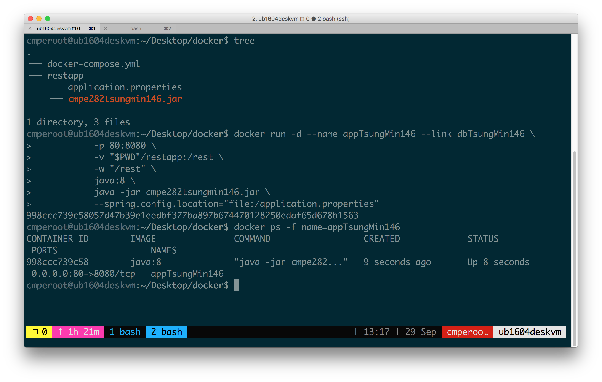

## Part3

### Docker status

While both containers are running on host1, include the screenshots of the following on host1

#### Docker version

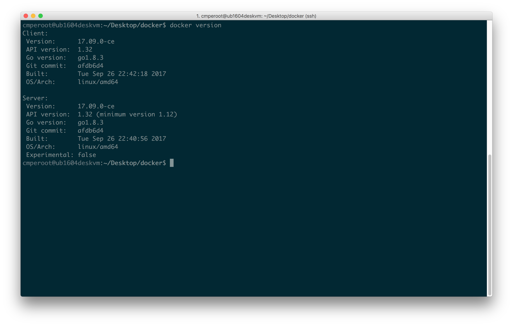

#### Docker ps

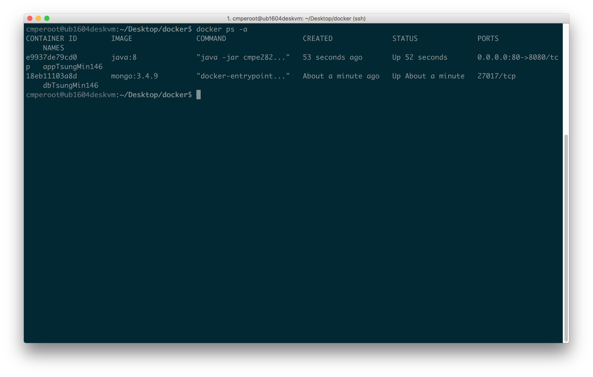

<div style="page-break-after: always;"></div>

#### Docker network inspect

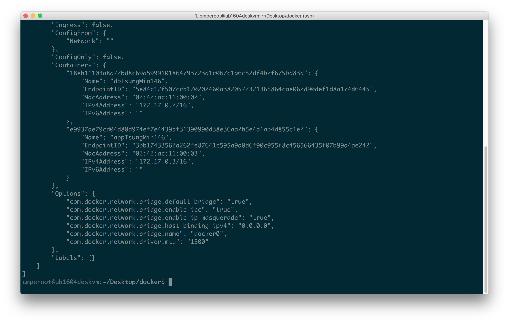

#### ip addr

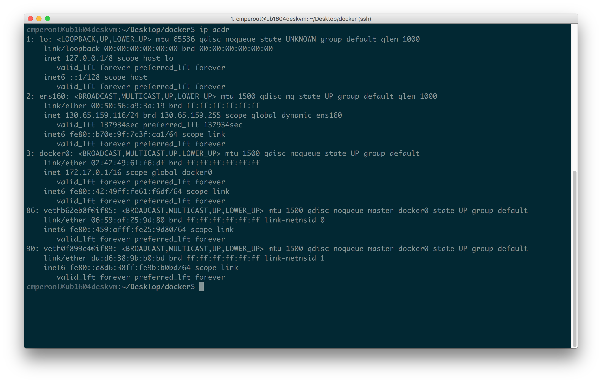

### REST service

#### issue a “POST /.../rest/employee”

request to create two employees with id 10 and 20

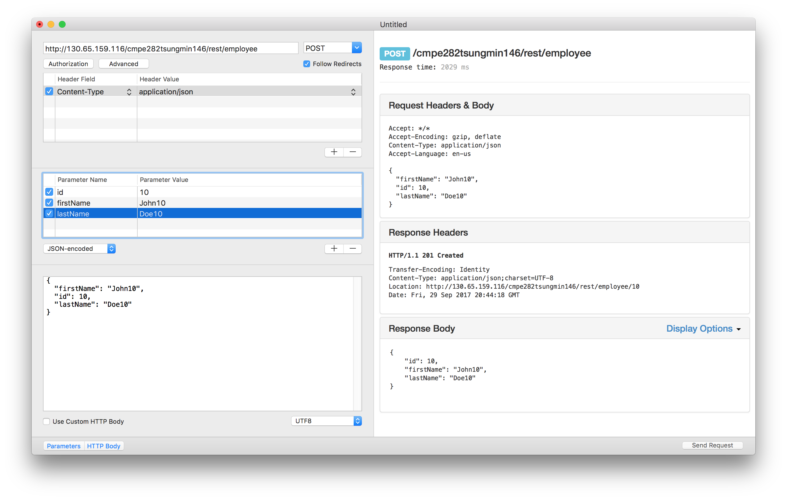


#### issue a “GET /.../rest/employee“

request to retrieve all employees

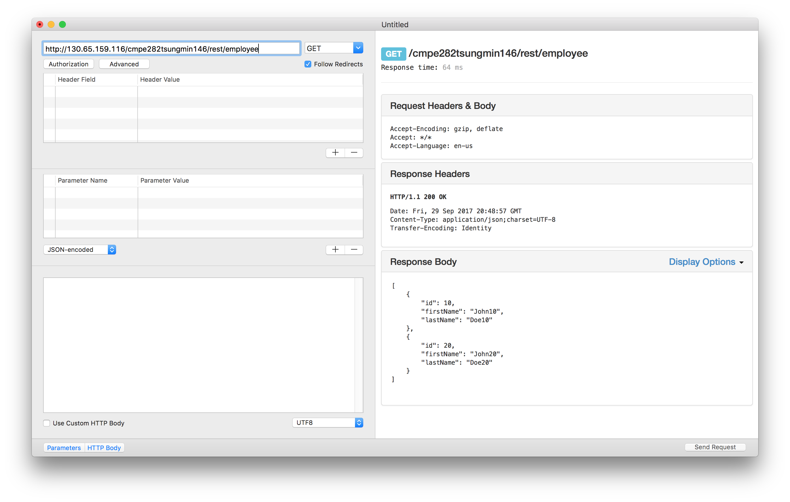

#### issue a “PUT /.../rest/employee/10“

request to update employee 10’s first name only

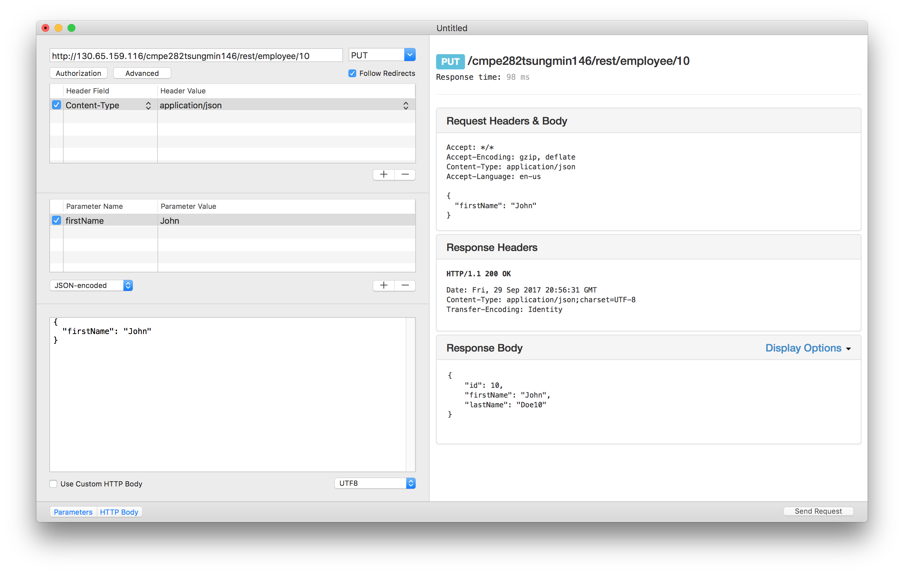

#### issue a “DELETE /.../rest/employee/20“

request to delete employee 20

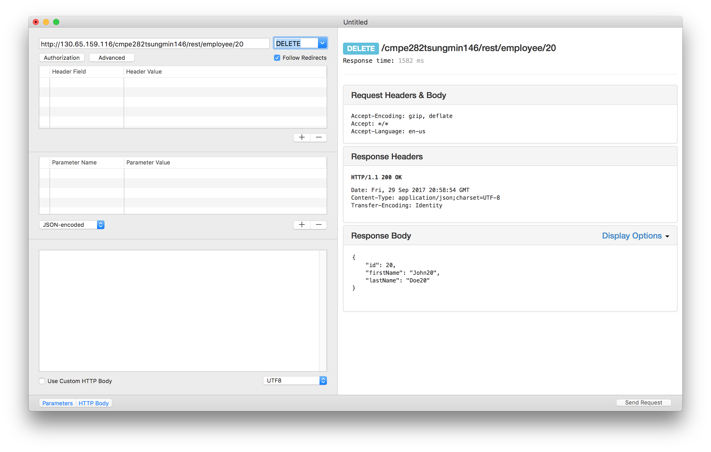

#### issue a “GET /.../rest/employee“

request to retrieve all employees

[REST_GET_ALL_UPDATE]: img/REST_GET_ALL_UPDATE.png

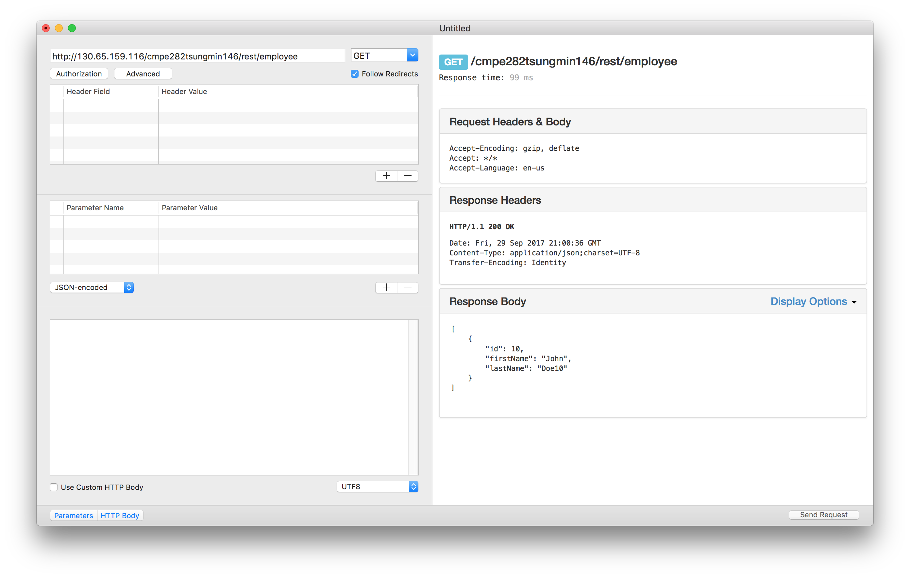

### Docker-compose

docker-compose.yml version 3 need docker 1.13.0+.
Using the following command to install latest docker-compose.

```bash
sudo curl -L \
https://github.com/docker/compose/releases/download/1.16.1/\
docker-compose-`uname -s`-`uname -m` \
-o /usr/local/bin/docker-compose
sudoc chmod +x /usr/local/bin/docker-compose
```

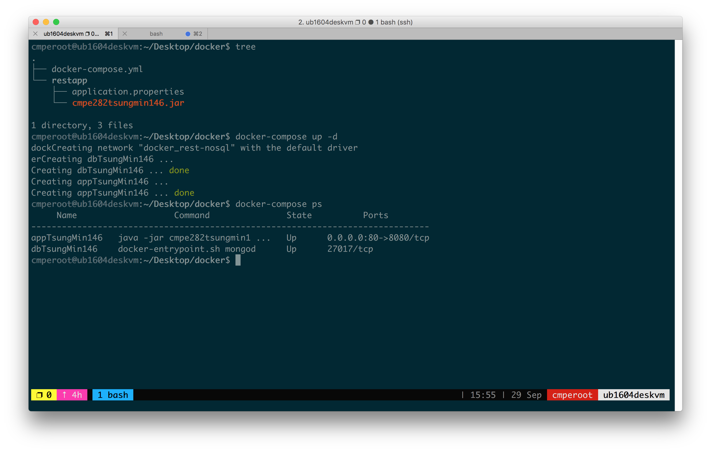

docker-compose.yml:

```yml
version: '3'
services:
  restapp:
    container_name: appTsungMin146
    image: java:8
    ports:
      - "80:8080"
    working_dir: /rest
    volumes:
      - ./restapp:/rest
    links:
      - mongodb
    networks:
      - rest-nosql
    command: [ "java",
               "-jar", "cmpe282tsungmin146.jar",
               "--spring.config.location=\"file:/application.properties\"" ]

  mongodb:
    container_name: dbTsungMin146
    image: mongo:3.4.9
    networks:
      rest-nosql:
        aliases:
          - dbTsungMin146
          # application.properties uri ignore case
          - dbtsungmin146

networks:
  rest-nosql:
```

#### issue a “POST /.../rest/employee”

request to create two employees with id 10 and 20

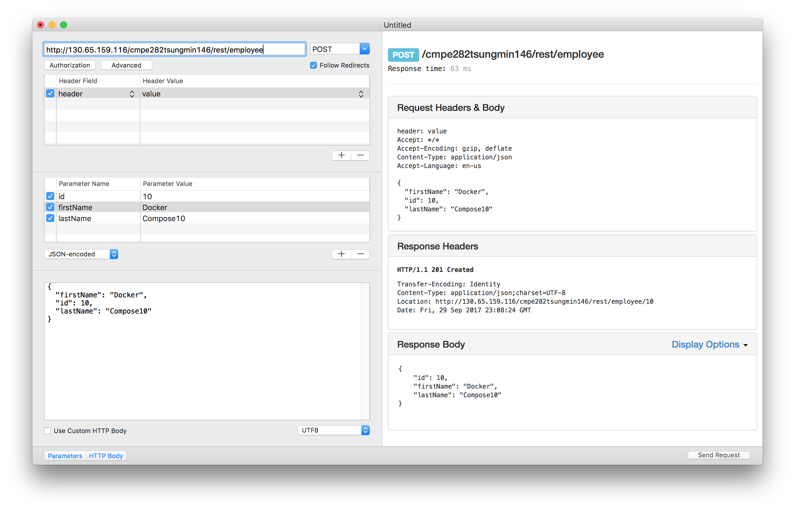

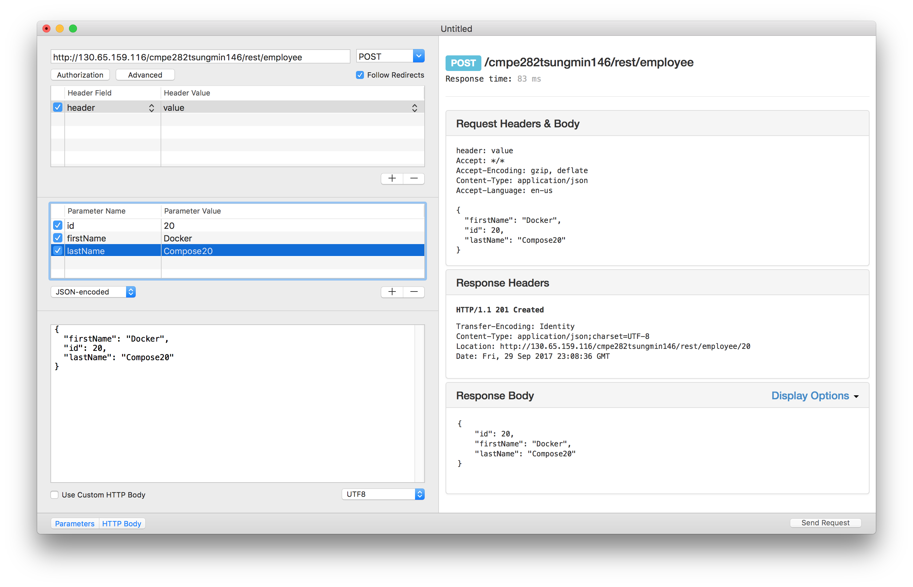

#### issue a “GET /.../rest/employee“

request to retrieve all employees

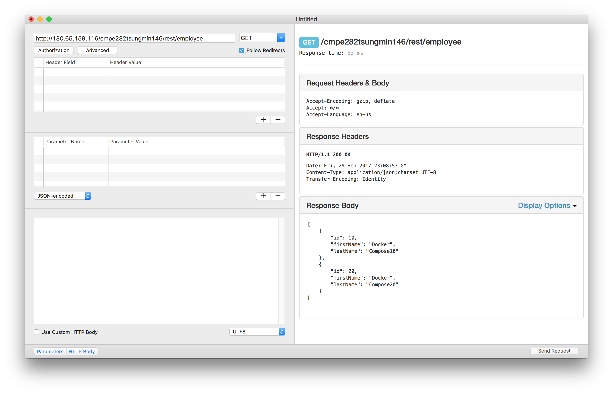
