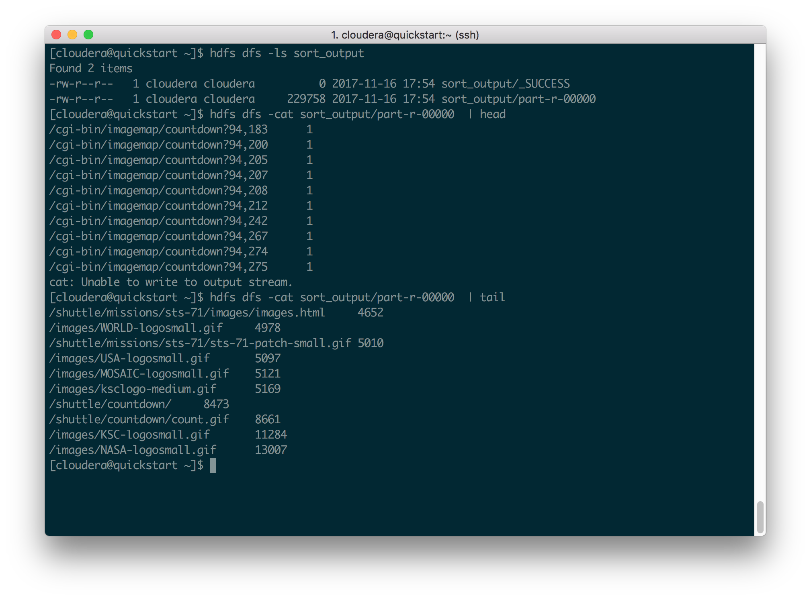

# MapReduce

Instructor: Prof Kong Li

Student: Tsung-Min Huang

- [MapReduce](#mapreduce)
    - [MapReduce Job Design](#mapreduce-job-design)
        - [URI Count Job](#uri-count-job)
        - [URI Count Sort Job](#uri-count-sort-job)
    - [Explain by example](#explain-by-example)
    - [Job screenshot](#job-screenshot)
        - [URI Count job](#uri-count-job)
        - [URI Sort job](#uri-sort-job)
        - [2nd Sort Job Issue](#2nd-sort-job-issue)

## MapReduce Job Design

### URI Count Job

1. For each record from file, used regular expression to extract its URI
2. In map phase, mapped to \<Key: URI, Value: COUNT> pair
3. In reduce phase and combine phase merge the value with same keys.

Job parameters

- input directory on the VM: count_input
- output directory on the VM: count_output
- number of map tasks: 3
- number of reduce tasks: 1

### URI Count Sort Job

1. For each record in the previous job, in \<***Key***: URI, ***Value***: COUNT> format.
2. In  map phase, swap the key and value from \<***Key***: URI, ***Value***: COUNT> to \<***Key***: COUNT, ***Value***: URI>
3. Let sort and shuffle to help sort Key: COUNT
4. In reduce phase, swap format back to \<***Key***: URI, ***Value***: COUNT>

- input directory on the VM: count_output
- output directory on the VM: sort_output
- number of map tasks: 1
- number of reduce tasks: 1

## Explain by example

1. The first job count the frequency of each URI

We do not change the sort and shuffle behavior. Thus the reduce output will be aggregated by \<***Key***: URI, ***Value***: COUNT>

```
uri1 3
uri2 1
uri3 2
uri4 1
uri5 3
```

2. In the second job, we swap \<***Key***: URI, ***Value***: COUNT> to \<***Key***: COUNT, ***Value***: URI> in the map phase. Used sort and shuffle to handle Key: COUNT order. In reduce phase swap key and value again.

```
    map            sort and shuffle         reduce
=========================================================    
  3 uri1              1 uri2                uri2 1
  1 uri2              1 uri4                uri4 1
  2 uri3      =>      2 uri3           =>   uri3 2
  1 uri4              3 uri1                uri1 3
  3 uri5              3 uri5                uri5 3
```

## Job screenshot

### URI Count job

```bash
hdfs dfs -ls count_input
```


```bash
URI_MAPREDUCE_JOB=edu.sjsu.cmpe282.mapreduce.hadoop.count.URICount_tsungmin146
export HADOOP_CLASSPATH=URIMapReduce_tsungmin146.jar
set mapreduce.job.maps=3
set mapreduce.job.reduces=1
hadoop $URI_MAPREDUCE_JOB count_input count_output
```


```bash
hdfs dfs -ls count_output
hdfs dfs -cat count_output/part-r-00000 | head
hdfs dfs -cat count_output/part-r-00000 | tail
```


### URI Sort job

```bash
hdfs dfs -ls count_output
```


```bash
URI_MAPREDUCE_JOB=edu.sjsu.cmpe282.mapreduce.hadoop.sort.URICountSort_tsungmin146
export HADOOP_CLASSPATH=URIMapReduce_tsungmin146.jar
set mapreduce.job.maps=1
set mapreduce.job.reduces=1
hadoop $URI_MAPREDUCE_JOB -Dmapreduce.job.maps=3 count_output sort_output
```


```bash
hdfs dfs -ls sort_output
hdfs dfs -cat sort_output/part-r-00000  | head
hdfs dfs -cat sort_output/part-r-00000  | tail
```



### 2nd Sort Job Issue

The current design used only 1 reduce task to guarantee the global order. However, this implementation can not fully utilize the cluster computation power. By using partition function, we can base on the hash function of the key, to send to the map result to different reduce task to performing sort similar bucket sorting.
